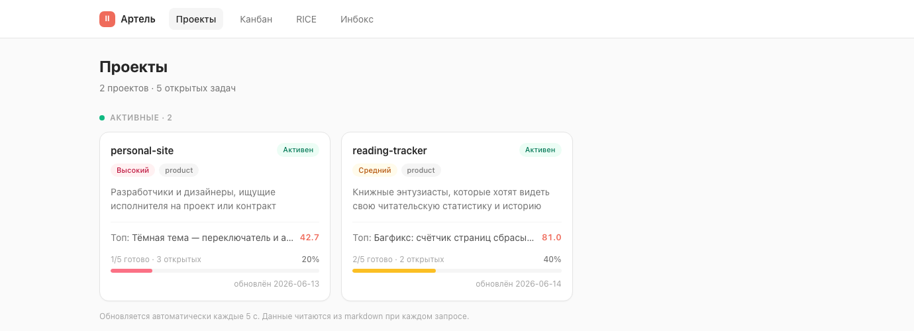
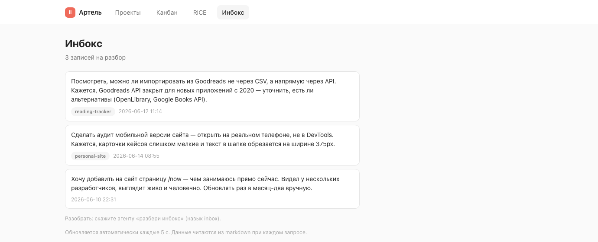

# Артель в деле

Вы разговариваете с ИИ-агентом о своих проектах. Он сам ведёт беклог: заводит задачи с приоритетами, двигает статусы, разбирает входящие мысли, не отчитывается «готово», пока работа не отражена и не проверена. Всё — обычный markdown в git: видно глазами, без вендор-лока, без БД.

Эта страница — чтобы за минуту понять, **ваш ли это инструмент**. Полная документация — в [README](README.md) и [docs/](docs/).

---

## Это для вас, если

- вы ведёте **несколько проектов с ИИ-агентом** (Claude Code, Cursor, Codex…) и теряете контекст между сессиями;
- хотите **системность** — приоритеты, статусы, «что я вообще сделал» — но без Jira и без настройки;
- не хотите вендор-лока: данные должны оставаться **простыми файлами**, которые переживут любой инструмент;
- готовы, чтобы рутину беклога вёл агент, а вы — только подтверждали закрытие.

**Не для вас, если** нужен командный трекер с правами и спринтами, real-time-доской и интеграциями — это однопользовательский, файловый, агент-центричный подход.

---

## Как это выглядит

Локальный дашборд (`npm run dashboard`, без зависимостей, только чтение) над тем же markdown-vault. Те же файлы открываются и в Obsidian.

**Проекты** — карточки со статусом, приоритетом, прогрессом и топ-задачей по RICE:



**Канбан** — задачи всех проектов по статусам, с номером тикета, RICE и тегами:


**RICE** — единый беклог, отсортированный по приоритету: `(reach × impact × confidence%) / effort`:


**Инбокс** — сырые мысли «на потом»; агент по команде превращает их в задачи:



---

## Сценарий: было → стало

**Было.** Идеи и задачи размазаны по заметкам, чатам с ИИ и голове. Новая сессия с агентом начинается с нуля: он не помнит, что вы делали вчера и почему. Приоритеты — на ощущение. «Что сделано за месяц?» — не ответить.

**Стало.** Один markdown-vault — общая память. Сессия начинается с «sync»: агент перечитывает проекты и задачи и сам предлагает, за что взяться (по RICE). По ходу разговора он заводит и двигает задачи, разбирает инбокс, фиксирует решения. Закрыть задачу может только ваш апрув — агент предъявляет, что сделал, и ждёт «ок». В конце недели «итоги» собираются из закрытых задач автоматически.

```
«посмотри что по задачам, бери запланированное в работу»
   → агент: sync → берёт верхнюю по RICE → doing → делает → review → ждёт апрува
«разбери инбокс»
   → 3 сырые записи → 3 задачи с RICE, инбокс пуст
«итоги недели»
   → что сделано и зачем, по проектам — для ревью или себе
```

---

## Что под капотом (коротко)

| Возможность | Что даёт |
|-------------|----------|
| **[RICE-приоритизация](docs/methodology.md)** | беклог сортируется сам — не спорите о важности |
| **[Сквозные тикеты + отслеживаемость](docs/workflow.md)** | по vault всегда восстановимо, что и когда делалось |
| **[Инбокс](docs/methodology.md)** | мысль не теряется: сырое → задача по команде |
| **[Роли по RICE](docs/roles.md)** | аналитик/ревьюер/техписатель включаются по порогам — глубина под задачу |
| **[Гейт «готово» + апрув закрытия](docs/workflow.md)** | агент не закрывает сам; «готово» = проверено и подтверждено |
| **[Тиринг моделей](docs/methodology.md)** | мелкую механику — дешёвой модели, рассуждение — сильной |
| **[Канон документации (APC)](docs/doc-canon.md)** | документ существует только при ясных адресате и цели, без воды |

---

## Попробовать за 2 минуты

1. **Use this template** (или склонируйте) → чистый vault.
2. Откройте папку в своём агенте и дайте вводный промпт из [README](README.md#как-включить-методологию-у-своего-агента). Скажите «sync».
3. `npm run dashboard` → http://localhost:4321 — посмотрите свой беклог так же, как на скриншотах выше.
4. Удалите `projects/example-project/` и заведите свой первый проект: «заведи проект …».

> Скриншоты сняты с демонстрационного vault (`personal-site` + `reading-tracker`) — чтобы показать живой беклог. В шаблоне лежит один пример-проект под удаление.
